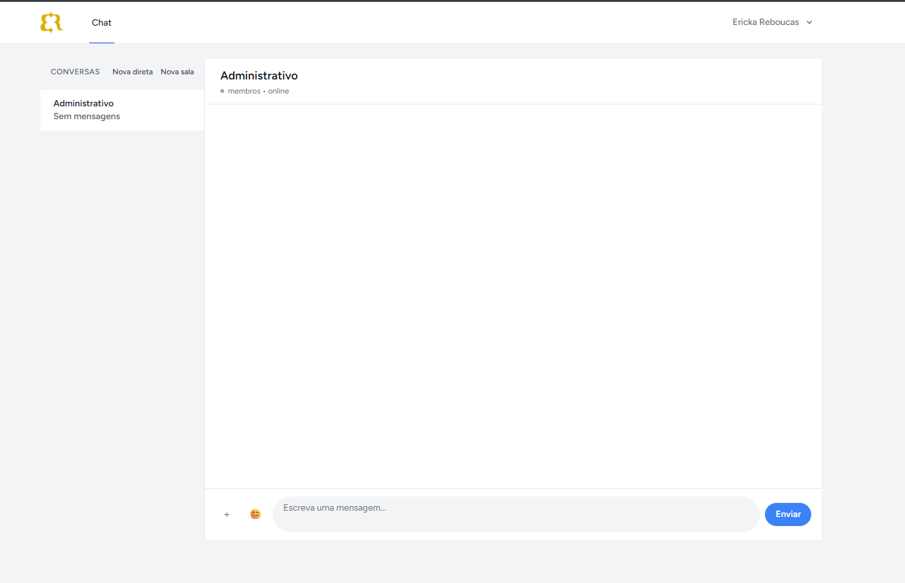
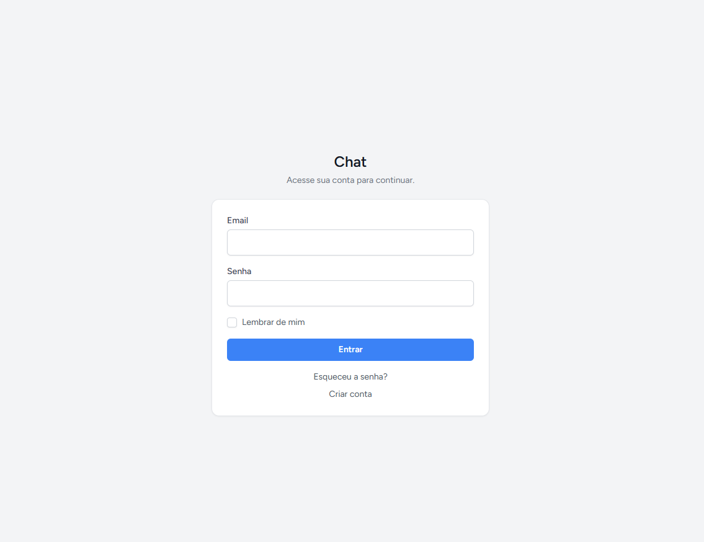
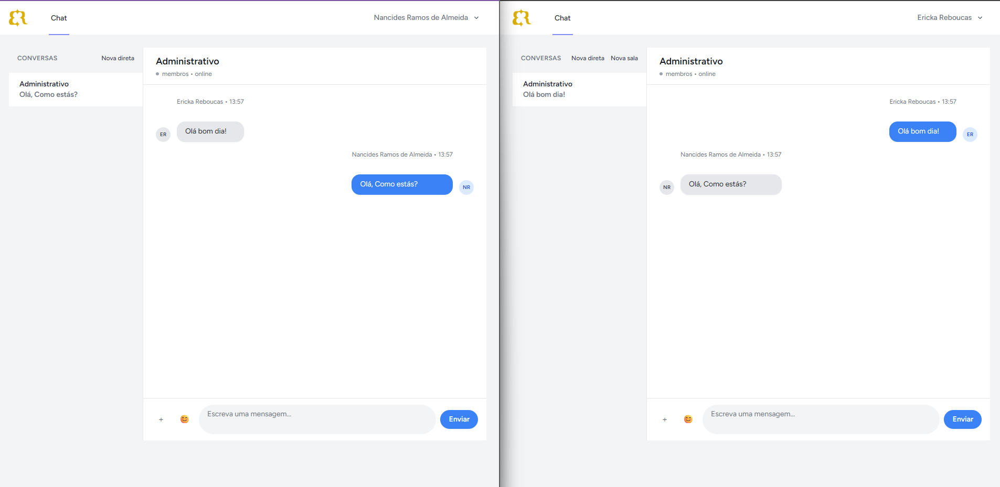

# Chat

Sistema de chat interno desenvolvido com Laravel + Vue (Inertia), inspirado na experiência de ferramentas como Messenger e Campfire.
O foco do projeto é oferecer comunicação rápida entre utilizadores, com salas e conversas diretas numa interface simples e limpa.

## Visão geral

A aplicação combina **páginas Inertia** (login, perfil, ecrã principal do chat) com uma **API JSON sob `/api/chat/*`** consumida pelo frontend com **Axios** e **Laravel Sanctum** (sessão stateful + CSRF). As mensagens são persistidas em **MySQL** (tabela `messages`, com suporte a salas e conversas diretas). O painel de chat (`/chat`) lista conversas na barra lateral, permite abrir salas ou DMs, enviar texto, anexos (em salas), emojis e reações; administradores podem criar salas e utilizadores.

## Stack técnica

| Camada          | Tecnologia                                                                  |
| --------------- | --------------------------------------------------------------------------- |
| Backend         | Laravel 13, PHP 8.3+                                                        |
| Frontend        | Vue 3, Inertia.js 2 (JavaScript)                                            |
| Bundler         | Vite 8, `laravel-vite-plugin`, `@vitejs/plugin-vue`                         |
| UI / Estilos    | Tailwind CSS 3, `@tailwindcss/forms`, emoji-mart / emoji-picker-element     |
| HTTP (SPA chat) | Axios, rotas API com prefixo `/api` + Sanctum (`statefulApi`)               |
| Base de dados   | MySQL (configurável via `.env`; exemplo: `DB_DATABASE=chat`)                |
| Autenticação    | Laravel Breeze (sessão), verificação de email, **Laravel Sanctum** para API |
| Qualidade (PHP) | Laravel Pint                                                                |
| Testes          | Pest 4 + `pest-plugin-laravel` (testes de feature em `tests/Feature/`)      |

---

## Funcionalidades

### Chat

- Conversas **diretas** entre dois utilizadores (abrir por utilizador, histórico de mensagens).
- **Salas** de chat (criação e gestão com perfil **admin**; utilizadores podem entrar com `join`).
- Mensagens de texto; **anexos / imagens** no envio para **salas** (multipart).
- **Emojis** no compositor (emoji-mart).
- **Reações** por mensagem (API dedicada).
- **Presença** (`/presence/ping`) e estado na barra lateral; leitura por conversa (`read`).
- Sidebar agregada (`/sidebar`) com salas, DMs e contagens de não lidas.

### Autenticação e contas

- Registo, login, logout, recuperação e redefinição de palavra-passe.
- Verificação de endereço de email (fluxo Breeze).
- Perfil: atualizar dados e palavra-passe, eliminar conta.
- Papel **`admin`** ou **`user`**: admins criam salas e utilizadores via API; middleware `role:admin` nas rotas indicadas.

### Segurança

- Rotas web e API protegidas por autenticação; API de chat com `auth:sanctum`.
- **Policies** Laravel (`ChatRoom`, `DirectConversation`, `Message`, `User`) para autorização fina.
- Sessão com cookies + CSRF nas petições Inertia/API stateful.
- Mensagens e metadados armazenados em texto na base de dados (sem encriptação end-to-end da mensagem).

### Testes

- Suíte Pest com testes de feature para autenticação, perfil e API de chat (mensagens diretas, salas, reações, segurança, etc.).

## Instalação

```bash
git clone <url-do-repositorio>
cd chat

composer install
npm install

cp .env.example .env
php artisan key:generate
php artisan migrate --seed

composer run dev
```

O comando `composer run dev` arranca o servidor PHP, o worker de filas e o Vite em paralelo (ver `composer.json`). Em alternativa, noutros terminais: `php artisan serve`, `php artisan queue:listen`, `npm run dev`.

**Contas de exemplo** (após `--seed`): por exemplo `admin@chat.local` / `password` (admin) e `user1@chat.local` / `password` (user). Ajuste conforme `DatabaseSeeder`.

## Preview

### Chat



### Ecrã inicial / lista



### Salas



## Estrutura relevante

| Caminho                                | Descrição                                                              |
| -------------------------------------- | ---------------------------------------------------------------------- |
| `routes/web.php`                       | Inertia: `/chat`, perfil, redirecionamento `/` → login                 |
| `routes/api.php`                       | Endpoints REST do chat sob `/api/chat/*` (Sanctum)                     |
| `routes/auth.php`                      | Rotas Breeze (login, registo, password, verificação)                   |
| `app/Services/Chat/ChatService.php`    | Lógica de conversas, mensagens, anexos, leituras                       |
| `app/Http/Controllers/Api/Chat/*`      | Controladores da API do chat                                           |
| `app/Models/`                          | `User`, `ChatRoom`, `DirectConversation`, `Message`, reações, leituras |
| `resources/js/Pages/Chat/Index.vue`    | Página principal do chat (Inertia)                                     |
| `resources/js/Components/chat/*`       | Shell, sidebar, janela, mensagens, compositor, modais                  |
| `resources/js/services/chatService.js` | Cliente Axios para a API do chat                                       |
| `database/migrations/*`                | Esquema de salas, mensagens, conversas diretas, etc.                   |

## Requisitos

- **PHP** 8.3 ou superior, extensões habituais do Laravel (mbstring, openssl, pdo, etc.)
- **Composer** 2.x
- **Node.js** e **npm** (versões compatíveis com Vite 8)
- **MySQL** (ou compatível) com base de dados criada (ex.: `chat`)
- Opcional: **Redis** se configurar cache/fila para Redis no `.env` (por defeito o exemplo usa `database` para cache, fila e sessão)

## Como executar

### 1. Clonar e entrar na pasta

```bash
git clone <url-do-repositorio>
cd chat
```

### 2. Dependências PHP e Node

```bash
composer install
npm install
```

### 3. Ambiente e chave da aplicação

```bash
cp .env.example .env
php artisan key:generate
```

Configure pelo menos `APP_URL`, `DB_*` e, se usar mail real, `MAIL_*`. Para o chat com sessão + API no mesmo domínio, `SESSION_DOMAIN` e Sanctum devem estar alinhados com o teu host (em local, `localhost` costuma bastar).

### 4. Migrações (e seed opcional)

```bash
php artisan migrate --seed
```

Garanta que `QUEUE_CONNECTION` e `SESSION_DRIVER` em `.env` estão coerentes (o exemplo usa `database` para fila e sessão; nesse caso as migrações criam as tabelas necessárias).

### 5. Servidor de desenvolvimento

```bash
composer run dev
```

Ou manualmente: `php artisan serve`, noutro processo `php artisan queue:listen`, e `npm run dev`. Aceda à URL do `artisan serve` (por defeito `http://127.0.0.1:8000`), faça login e abra **`/chat`**.

## Qualidade e testes

### Testes

```bash
composer test
# ou
php artisan test
```

### Lint / formatação (PHP)

```bash
./vendor/bin/pint
```

O projeto **não** inclui ESLint, Prettier ou `vue-tsc` no `package.json`; o frontend é JavaScript (.vue / .js).

### Pipeline completo (como em CI)

Exemplo mínimo:
`composer install`,
`cp .env.example .env`,
`php artisan key:generate`,
`php artisan test`,
e para deploy
`npm ci && npm run build` +
`php artisan migrate --force` no servidor.

## Build para produção

```bash
npm run build
php artisan config:cache
php artisan route:cache
php artisan view:cache
```

Garantir que o ambiente de produção serve os assets compilados (`public/build`), que `APP_ENV=production`, `APP_DEBUG=false`, e que o servidor web aponta para `public/`. Configure filas e workers se usar `QUEUE_CONNECTION=database` ou Redis.

---

## Notas

- A UI principal do chat é **Inertia + Vue**; as operações em tempo real no browser usam a **API** com cookies Sanctum (não é uma SPA totalmente desacoplada).
- **Broadcasting** está, no `.env` de exemplo, como `BROADCAST_CONNECTION=log`; eventos existem no código, mas websockets em tempo real exigem configurar Laravel Echo / Pusher (ou similar) à parte.
- A rota **`/`** redireciona para **`/login`**; após autenticação o chat está em **`/chat`**.
- Logótipo e favicon podem ser servidos a partir de `public/images/` (ver `ApplicationLogo.vue` e `resources/views/app.blade.php`).

---

**Autor:** Ericka Rebouças
